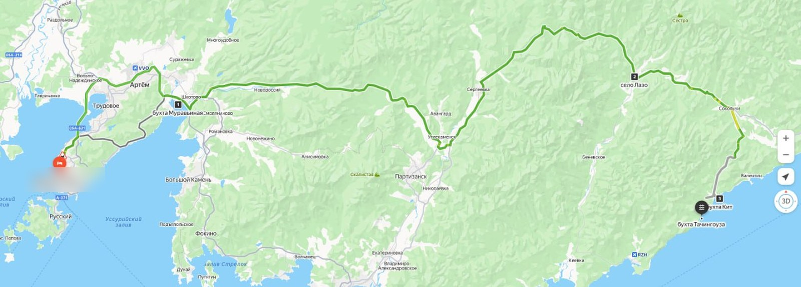
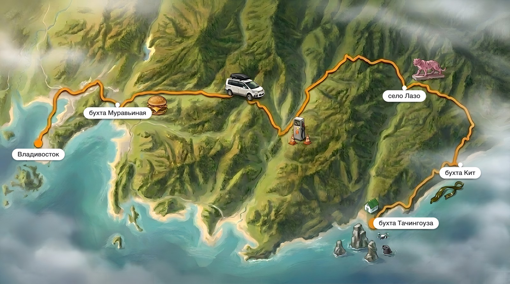

# Route Atlas

Скилл для [Claude Code](https://docs.anthropic.com/en/docs/claude-code), который
превращает обычный скриншот маршрута в карту, какую рисуют для книжек про
путешествия.

Было — скриншот из карт:



Стало — карта того же маршрута:



Тот же берег, те же дороги, те же бухты. Плюс то, чего на обычной карте не бывает:
бургер на месте придорожного пит-стопа, колонка с конусами там, где заправка
оказалась закрыта, розовый бетонный тигр у въезда в заповедник, ламинария
на песке, кекуры с нерпой и дроном, домик кордона в конце пути. Всё это было
на самом деле — карта рассказывает историю поездки, а не украшает её.

---

## Что делает

Берёт ваш скриншот маршрута (Яндекс, Google, OpenStreetMap) и перерисовывает его
в иллюстрированную псевдо-3D карту: настоящий рельеф местности, линия маршрута
вашего фирменного цвета, аккуратные подписи и маленькие картинки-виньетки того,
что случилось в дороге.

Стиль вы собираете свой, а не берёте готовый. Скилл проводит через студию стиля
один раз, сохраняет результат паспортом — и дальше все карты выходят одинаковыми
по почерку. Через год вернётесь к серии — она не развалится.

## Зачем это, если можно просто попросить нейросеть

Можно. И получится красивый вымышленный край: берег не тот, маршрут кольцом,
названия с опечатками. Проверено — именно так и выглядят первые попытки.

Ценность здесь не в промпте, а в протоколе вокруг модели.

| Проблема | Что делает Route Atlas |
|----------|------------------------|
| Модель выдумывает географию | Карта рисуется **поверх вашего скриншота** в режиме редактирования, а не по описанию |
| Модель врёт в надписях | Карта генерится **вообще без единой буквы**. Названия ставятся программно, ровным шрифтом, без шанса на опечатку |
| Модель дорисовывает лишнее | Виньетка **без источника не рисуется**. Ассистент спрашивает, что и где было, и в конце отчитывается, откуда взял каждую картинку |
| Каждая правка ломает то, что нравилось | Правки **точечные, по одной**, с фиксацией всего остального |
| Картинка мыльная и мелкая | Разрешение поднимает **классический апскейлер**, а не «нейро-улучшайзер», который заодно перерисует вашу карту |
| Вторая карта не похожа на первую | Стиль заморожен **паспортом**: формула, цвета, кегль подписей, размер виньеток |

## Как устроено

| Этап | Когда | Что происходит |
|------|-------|----------------|
| **Движок** | один раз | Находит, чем рисовать: подключённый image-MCP, ваш ключ Google AI или OpenAI. Нет ничего — помогает подключить |
| **Студия стиля** | один раз | Четыре оси вкуса, три-четыре пробных карты, ваш выбор → паспорт стиля |
| **Производство** | каждая карта | Сбор точек и событий → спецификация на утверждение → генерация → правки → подписи и разрешение → отчёт |

Внутри производства две точки остановки: спецификацию вы утверждаете **до**
генерации, картинку — до финализации. Ассистент не уходит вперёд молча.

## Принципы

- **География — с вашего скриншота.** Модель не знает, как выглядит этот берег.
  Она знает ровно то, что видит на исходнике.
- **События — от вас.** «Пусть тут будет кораблик для красоты» — запрещено.
  Выдуманная деталь на карте своего маршрута обесценивает всю карту.
- **Текст рисует не модель.** Единственный надёжный способ получить подписи
  без опечаток — не давать модели писать вообще.
- **Ваш стиль, а не общий пресет.** Иначе карты всех пользователей скилла
  выглядели бы одинаково, и ничья не была бы узнаваемой.

## Что нужно

**Обязательно:** Python 3.8+ и три библиотеки:

```bash
pip3 install pillow numpy requests
```

**Движок генерации — любой из:**

- уже подключённый в вашем клиенте image-MCP (Nano Banana, Gemini и подобные) —
  тогда ключи не нужны вовсе;
- свой ключ Google AI — у Gemini есть бесплатный тариф;
- ключ OpenAI — запасной путь: картинка красивая, но география поплывёт.

Главное требование: движок должен уметь **редактировать поданную картинку**,
а не только рисовать с нуля. Сравнение — в
[references/backends.md](references/backends.md).

**Желательно:** [Real-ESRGAN](https://github.com/xinntao/Real-ESRGAN/releases)
для повышения разрешения (карта выше — 5504×3072 именно благодаря ему) и
`pip3 install keyring fonttools`.

## Установка

```bash
git clone https://github.com/TimurUgulava/route-atlas.git ~/.claude/skills/route-atlas
cd ~/.claude/skills/route-atlas
python3 scripts/check_setup.py
```

**Без git** (например, на свежей Windows): скачайте архив кнопкой
**Code → Download ZIP** на странице репозитория и распакуйте в
`C:\Users\<вы>\.claude\skills\route-atlas`.

**На Windows** команда обычно `python`, а не `python3` — дальше по тексту
подставляйте свою. И сразу поставьте `keyring`: без него ключ ляжет в файл,
а с ним — в Диспетчер учётных данных Windows.

```
pip install pillow numpy requests keyring
python scripts\check_setup.py
```

Диагностика покажет, что есть и чего не хватает, с готовыми командами. Если нет
ни MCP, ни ключа:

```bash
python3 scripts/setup_key.py --backend gemini
```

## Как использовать

Скажите Claude Code:

- «нарисуй карту маршрута»
- «оформи наш маршрут красиво»
- «сделай карту поездки»

и приложите скриншот. Дальше он проведёт по шагам сам. В первый раз добавится
студия стиля — минут пятнадцать, один раз в жизни.

Скрипты работают и руками:

```bash
# генерация (если нет MCP)
python3 scripts/generate.py --prompt "..." --input screenshot.jpg \
    --aspect 16:9 --output map.png

# подписи + разрешение
python3 scripts/finalize.py --input map.png --labels labels.json \
    --output final.png --also-half
```

Файл подписей — координаты в долях от размера кадра:

```json
[
  {"text": "Владивосток", "x": 0.077, "y": 0.543, "dot": [0.075, 0.505]},
  {"text": "село Лазо",   "x": 0.794, "y": 0.339}
]
```

## Безопасность

**Ключи.** Не пересылаются в переписке, не передаются аргументами команд (такого
флага в скриптах нет намеренно: аргументы видны в списке процессов и остаются
в истории оболочки) и не выводятся на экран. Ключ вводит владелец в невидимом поле
`setup_key.py`, скрипт проверяет его у сервиса и кладёт в системное хранилище
секретов: Связка ключей на macOS, Диспетчер учётных данных на Windows, Secret
Service на Linux. Нет `keyring` — тогда в файл `.env`, закрытый от git и от
посторонних (права 600 на macOS и Linux, `icacls` на Windows). Ассистенту доступен
только факт «подключено».

**Что уходит с вашей машины.** Если рисуете через `generate.py`, ваш скриншот
и текст промпта отправляются в API выбранного сервиса — Google или OpenAI, иначе
картинку не получить. Если в сессии уже подключён image-MCP, скрипт не задействуется
вовсе и трафик идёт туда, куда настроен ваш MCP. Больше никуда ничего не уходит:
телеметрии нет, своих серверов у скилла нет, апскейл и подписи считаются локально.

## Структура

```
route-atlas/
├── SKILL.md                        # протокол: движок → студия стиля → производство
├── references/
│   ├── style-studio.md             # как собрать свой стиль и сохранить паспортом
│   ├── production.md               # промпт, чек-листы, формулы правок, грабли моделей
│   └── backends.md                 # сравнение движков, безопасность ключей, апскейлер
├── scripts/
│   ├── check_setup.py              # что установлено, чего не хватает
│   ├── setup_key.py                # безопасное подключение ключа
│   ├── generate.py                 # генерация через доступный API
│   └── finalize.py                 # программные подписи + повышение разрешения
└── assets/
    └── style-passport-template.md  # шаблон паспорта стиля
```

---

## Автор

[Тимур Угулава](https://t.me/+ZPqkVNfhlA1mNWIy) — про AI-ассистентов, скиллы
и то, как это всё приделать к живой работе.

Карта в примере — из travel-блога автора: дорога из Владивостока в Лазовский
заповедник, июль 2026.

## Лицензия

MIT — делайте что хотите, ссылка приветствуется.
