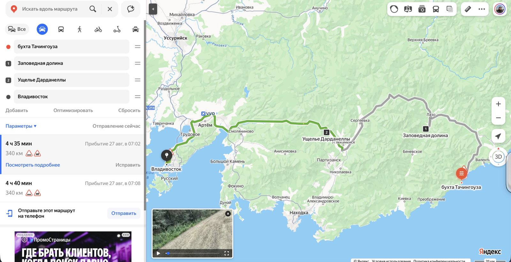
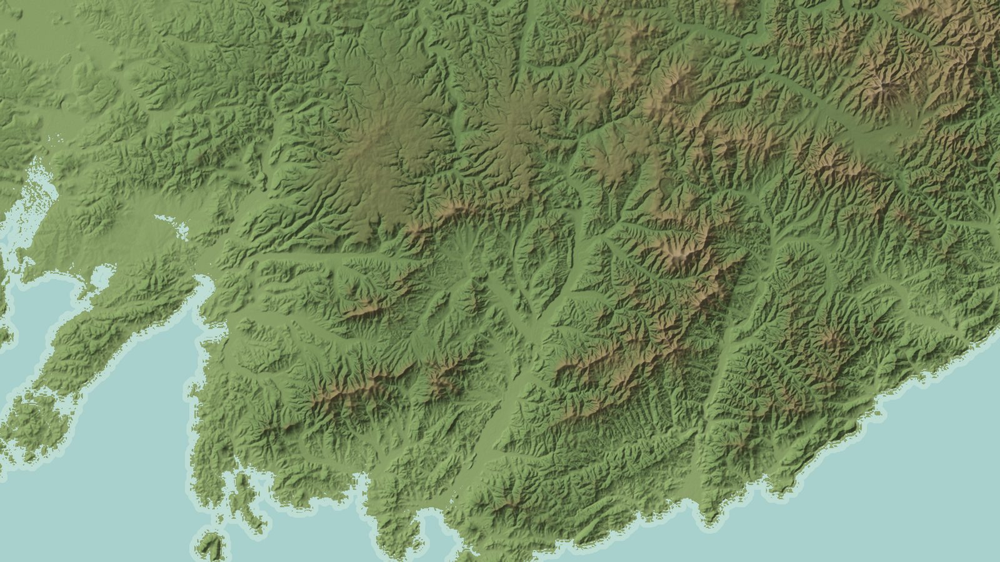
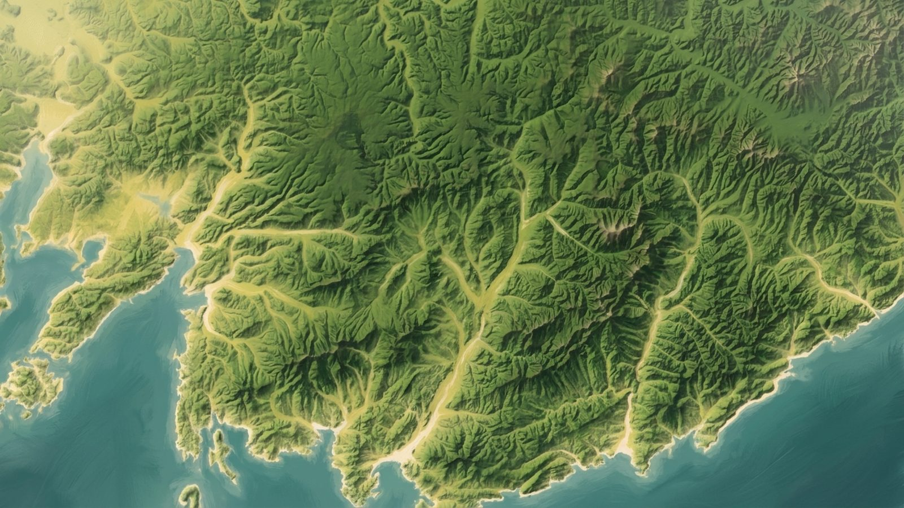
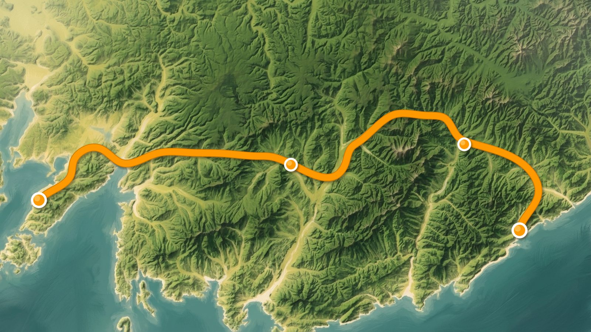
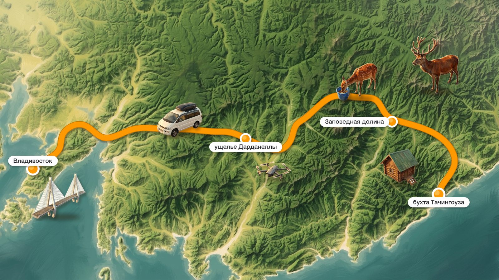

# Route Atlas

Скилл для [Claude Code](https://docs.anthropic.com/en/docs/claude-code), который
превращает обычный скриншот маршрута в карту, какую рисуют для книжек про
путешествия.

Карта собирается слоями — вот живая последовательность одной настоящей карты
(Приморье, поездка на маралью ферму), слой за слоем.

**0. Было — скриншот из карт.** Отсюда берутся две вещи: какой кусок Земли
рисуем (геопривязка по городам) и где шёл маршрут (оцифровка линии):



**1. Рельеф из настоящих данных высот.** Ни одного пикселя от нейросети:
открытые спутниковые данные, берег и сопки настоящие. Уже на этом слое маршрут
ложится в долины сам — по координатам:



**2. Покраска.** Единственное место, где работает генеративная модель: один
проход, стиль описан словами из паспорта автора. После — автоматическая
проверка, что география уцелела (здесь совпадение морей 0.84, медианный сдвиг
берега 2 пикселя):



**3. Маршрут и точки.** Рисует скрипт: сглаженный сплайн, фирменный цвет,
пластика из настроек автора. Линия не может уехать, порваться или уйти за
финиш — по построению:



**4. Виньетки и подписи.** Картинки реальных событий поездки — олень с ведром,
белый минивэн, коптер, домик кордона — вживляются с тенями по свету сцены;
подписи ставятся программно, без шанса на опечатку:



Всё, что нарисовано, было на самом деле — карта рассказывает историю поездки,
а не украшает её. А поскольку каждый слой независим, любая правка («точки
крупнее», «подвинь домик», «замени виньетку») — это перерисовка одного слоя
за секунды, а не новая генерация-лотерея.

---

## Что делает

Берёт ваш скриншот маршрута (Яндекс, Google, OpenStreetMap) и собирает по нему
иллюстрированную псевдо-3D карту слоями: по скриншоту вычисляется, какой кусок
Земли он показывает, рельеф этого куска строится из настоящих спутниковых
данных высот, нейросеть один раз красит его в ваш стиль (и скрипт проверяет,
что география уцелела), а линия маршрута фирменного цвета, точки, подписи
и картинки-виньетки событий ложатся сверху программно — точно по координатам.

Стиль вы собираете свой, а не берёте готовый. Скилл проводит через студию стиля
один раз, сохраняет результат паспортом — и дальше все карты выходят одинаковыми
по почерку. Через год вернётесь к серии — она не развалится.

## Зачем это, если можно просто попросить нейросеть

Можно. И получится красивый вымышленный край: берег не тот, маршрут кольцом,
названия с опечатками. Проверено — именно так и выглядят первые попытки.

Ценность здесь не в промпте, а в протоколе вокруг модели.

| Проблема | Что делает Route Atlas |
|----------|------------------------|
| Модель выдумывает географию | Рельеф строится **из настоящих данных высот** по геопривязке вашего скриншота; модель его только красит, и скрипт **измеряет**, не сдвинулся ли берег (провал — перегенерация или откат, решает не «на глаз») |
| Модель рисует маршрут кольцом, уводит за финиш | Маршрут **не рисует модель**: линию и точки кладёт скрипт ровно по оцифрованным координатам — она не может уехать по построению |
| Модель врёт в надписях | Карта генерится **вообще без единой буквы**. Названия ставятся программно, ровным шрифтом, без шанса на опечатку |
| Модель молча дорисовывает за вас | Ассистент **спрашивает**, что и где было, или берёт детали из вашего текста — и в конце отчитывается, откуда взял каждую картинку. Захотите что-то от себя — просто скажите |
| Каждая правка ломает то, что нравилось и мылит картинку | Карта собрана **слоями**: правка — это перерисовка одного слоя за секунды. База не перегенерируется, качество не деградирует ни на какой итерации |
| Вторая карта не похожа на первую | Стиль заморожен **паспортом**: формула покраски, пластика линии в route-style.json, кегль подписей, размер виньеток |

## Как устроено

| Этап | Когда | Что происходит |
|------|-------|----------------|
| **Движок** | один раз | Находит, чем красить: подключённый image-MCP, ваш ключ Google AI или OpenAI. Нет ничего — помогает подключить; карта возможна и вовсе без движка (без покраски и виньеток) |
| **Студия стиля** | один раз | Четыре оси вкуса, пробные покраски одной точной базы, бесплатная калибровка линии и точек → паспорт стиля + route-style.json |
| **Производство** | каждая карта | Сбор точек и событий → геопривязка и оцифровка → спецификация на утверждение → рельеф из данных высот → одна покраска под контролем дрейфа → слои: маршрут, виньетки, подписи → отчёт |

Внутри производства три точки остановки: спецификацию вы утверждаете **до**
генерации, покрашенную базу — до наложения слоёв, собранную карту — до сдачи.
Ассистент не уходит вперёд молча.

## Принципы

- **География — из данных, а не из головы модели.** Скриншот задаёт, какой
  кусок Земли рисуем и где шёл маршрут; рельеф и берег берутся из открытых
  спутниковых данных высот. Модель ничего из этого не рисует — только красит,
  под измеряемым контролем.
- **События — ваши, а не додуманные за вас.** Скилл сам спрашивает, что и где
  было, и вытаскивает детали из вашего текста, если вы его дали. Разница не в том,
  можно ли рисовать красивое, а в том, откуда оно взялось: карта поездки должна
  показывать вашу поездку, а не догадку модели о ней. Хочется добавить что-то
  для настроения — скажите, и оно появится.
- **Текст рисует не модель.** Единственный надёжный способ получить подписи
  без опечаток — не давать модели писать вообще.
- **Ваш стиль, а не общий пресет.** Иначе карты всех пользователей скилла
  выглядели бы одинаково, и ничья не была бы узнаваемой.

## Что нужно

**Обязательно:** Python 3.8+ и четыре библиотеки:

```bash
pip3 install pillow numpy scipy requests
```

**Движок покраски — любой из:**

- уже подключённый в вашем клиенте image-MCP (Nano Banana, Gemini и подобные) —
  тогда ключи не нужны вовсе;
- свой ключ Google AI — у Gemini есть бесплатный тариф;
- ключ OpenAI — запасной путь: покраска чаще будет браковаться контролем дрейфа;
- **ничего** — карта соберётся на точной базе из данных высот, без
  художественной покраски и виньеток.

Для покраски движок должен уметь **редактировать поданную картинку**,
а не только рисовать с нуля. Сравнение — в
[references/backends.md](references/backends.md).

**Желательно:** апскейлер Real-ESRGAN — если карта нужна для печати; гоняется
по покрашенной базе до наложения слоёв. Ставится одной командой:

```bash
python3 scripts/install_upscaler.py
```

Скрипт сам определит систему, скачает нужную сборку и распакует куда надо
(на macOS ещё и снимет карантин). Плюс `pip3 install keyring fonttools`.

## Установка

```bash
git clone https://github.com/TimurUgulava/route-atlas.git ~/.claude/skills/route-atlas
cd ~/.claude/skills/route-atlas
python3 scripts/check_setup.py
```

**Без git** (например, на свежей Windows): скачайте архив кнопкой
**Code → Download ZIP** на странице репозитория и распакуйте в
`C:\Users\<вы>\.claude\skills\route-atlas`.

**На Windows** команда обычно `python`, а не `python3` — дальше по тексту
подставляйте свою. И сразу поставьте `keyring`: без него ключ ляжет в файл,
а с ним — в Диспетчер учётных данных Windows.

```
pip install pillow numpy requests keyring
python scripts\check_setup.py
```

Диагностика покажет, что есть и чего не хватает, с готовыми командами. Если нет
ни MCP, ни ключа:

```bash
python3 scripts/setup_key.py --backend gemini
```

## Как использовать

Скажите Claude Code:

- «нарисуй карту маршрута»
- «оформи наш маршрут красиво»
- «сделай карту поездки»

и приложите скриншот. Дальше он проведёт по шагам сам. В первый раз добавится
студия стиля — минут пятнадцать, один раз в жизни.

Скрипты работают и руками — полная цепочка v2:

```bash
# 1. геопривязка скриншота (якоря-города готовит ассистент)
python3 scripts/fit_georef.py --anchors anchors.json --out georef.json

# 2. настоящий рельеф из открытых данных высот
python3 scripts/render_terrain.py --georef georef.json \
    --out terrain.png --landmask landmask.npy

# 3. покраска движком (или MCP), затем контроль, что география уцелела
python3 scripts/generate.py --prompt "<шаблон покраски>" --input terrain.png \
    --output painted.png
python3 scripts/drift_check.py --painted painted.png --landmask landmask.npy

# 4. слои: маршрут → виньетки → подписи
python3 scripts/draw_route.py --base painted.png --geometry geometry.json \
    --style route-style.json --out with-route.png
python3 scripts/place_vignettes.py --base with-route.png \
    --placement placement.json --sprites vignettes/ --out full.png
python3 scripts/finalize.py --input full.png --labels labels.json \
    --output final.png --no-upscale
```

Файл подписей — привязка к точкам маршрута, координаты в долях от размера кадра:

```json
[
  {"text": "Москва", "anchor": [0.424, 0.820], "side": "below", "dot": true},
  {"text": "Переславль-Залесский", "anchor": [0.613, 0.349], "side": "left"}
]
```

`anchor` — координаты самой точки на карте, `side` — с какой стороны лечь капсуле.
Зазор считает скрипт, поэтому подписи стоят ровным рядом. Снять координаты
помогает флаг `--grid`: он кладёт рядом копию карты с координатной сеткой.

## Безопасность

**Ключи.** Не пересылаются в переписке, не передаются аргументами команд (такого
флага в скриптах нет намеренно: аргументы видны в списке процессов и остаются
в истории оболочки) и не выводятся на экран. Ключ вводит владелец в невидимом поле
`setup_key.py`, скрипт проверяет его у сервиса и кладёт в системное хранилище
секретов: Связка ключей на macOS, Диспетчер учётных данных на Windows, Secret
Service на Linux. Нет `keyring` — тогда в файл `.env`, закрытый от git и от
посторонних (права 600 на macOS и Linux, `icacls` на Windows). Ассистенту доступен
только факт «подключено».

**Что уходит с вашей машины.** Если рисуете через `generate.py`, ваш скриншот
и текст промпта отправляются в API выбранного сервиса — Google или OpenAI, иначе
картинку не получить. Если в сессии уже подключён image-MCP, скрипт не задействуется
вовсе и трафик идёт туда, куда настроен ваш MCP. Больше никуда ничего не уходит:
телеметрии нет, своих серверов у скилла нет, апскейл и подписи считаются локально.

## Структура

```
route-atlas/
├── SKILL.md                        # протокол: движок → студия стиля → производство
├── references/
│   ├── prompt-base.md              # базовый промпт: 7 блоков против известных дефектов
│   ├── style-studio.md             # как собрать свой стиль и сохранить паспортом
│   ├── production.md               # чек-листы, формулы правок, грабли моделей
│   └── backends.md                 # сравнение движков, безопасность ключей, апскейлер
├── scripts/
│   ├── check_setup.py              # что установлено, чего не хватает
│   ├── setup_key.py                # безопасное подключение ключа
│   ├── install_upscaler.py         # автоустановка Real-ESRGAN под вашу систему
│   ├── grab_screenshot.py          # скриншот из буфера обмена в файл
│   ├── generate.py                 # генерация через доступный API
│   └── finalize.py                 # программные подписи + повышение разрешения
└── assets/
    └── style-passport-template.md  # шаблон паспорта стиля
```

---

## Автор

[Тимур Угулава](https://t.me/+ZPqkVNfhlA1mNWIy) — про AI-ассистентов, скиллы
и то, как это всё приделать к живой работе.

Карта в примере — из travel-блога автора: дорога из Владивостока в Лазовский
заповедник, июль 2026.

## Лицензия

MIT — делайте что хотите, ссылка приветствуется.
